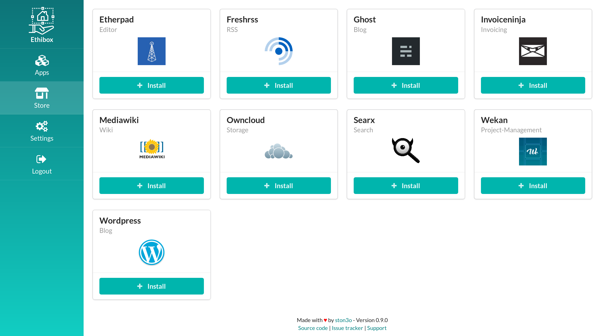

# Ethibox

[](https://github.com/ethibox/ethibox/releases)
[](https://raw.githubusercontent.com/ethibox/ethibox/master/LICENSE.txt)
[](https://travis-ci.org/ethibox/ethibox/branches)
[](https://codeclimate.com/github/ethibox/ethibox)
[](https://liberapay.com/ston3o/donate)

> Host your websites effortlessly

Simple UI to search, install, update, configure, backup, check, rollback, secure, expose, scale, monetize & uninstall your free softwares.

##### [Docs](https://ethibox.io) | [FAQ](https://ethibox.fr/faq) | [Contributing](https://github.com/ethibox/ethibox/blob/master/.github/CONTRIBUTING.md)



## Features

* [x] Host and manage your applications effortlessly
* [x] Become indie hoster by monetizing your infrastructure with Stripe
* [x] Kubernetes Support
* [ ] [+50 free softwares](https://github.com/ethibox/store) to install in one click
* [ ] Docker Swarm Support
* [ ] Raspberry PI Support

## Deployment

### Deploy with Docker

```bash
docker run --name ethibox -p 4444:4444 ethibox/ethibox
```

### Deploy with kubectl (Kubernetes)

```bash
kubectl run ethibox --image=ethibox/ethibox --port=4444 --expose
```

### Deploy with helm (Kubernetes)

```bash
helm install --name ethibox https://store.ethibox.io/kubernetes/packages/ethibox-0.1.0.tgz
```

### Deploy with Terraform

COMING SOON!

## How it works ?

Ethibox allows you to search, install, update, configure, backup, check, rollback, scale, monetize & uninstall applications.
**NOTE: To use Ethibox you need an orchestrator like Kubernetes or Docker Swarm**.

[](https://www.draw.io/#Hethibox/ethibox/master/docs/images/workflow.png)

## How to create application ?

### Create via docker-compose.yaml

COMING SOON!

### Create via helm

1) Clone Ethibox starter

```bash
git clone https://github.com/ethibox/helm-starter ~/.helm/starters/helm-starter
```

2) Create Application based on starter

```bash
helm create -p helm-starter <application>
```

3) Edit your application

- Chart.yaml
- values.yaml
- etc...

4) Synchronize store

- Edit your apps.json file
- Synchronize store from Ethibox settings

## Contributing

We welcome contributions in all forms. Please check out the [contributing guide](https://github.com/ethibox/ethibox/blob/master/.github/CONTRIBUTING.md) for more information.

Participation in this project is subject to a [code of conduct](https://github.com/ethibox/ethibox/blob/master/.github/CODE_OF_CONDUCT.md).

### Build Ethibox locally

These instructions will get you a copy of the project up and running on your local machine for development and testing purposes. See [deployment](#Deployment) to deploy the project on a live system.

To clone and run this application, you'll need Git, Docker and Node.js (which comes with npm) installed on your computer. From your command line:

```bash
# Clone this repository
git clone https://github.com/ethibox/ethibox

# Go into the repository
cd ethibox

# Install dependencies
npm install

# Run the app
npm run docker:start

# Go to http://localhost:3000
```

### Running the tests

```bash
npm test
```

## Support

Support me with a monthly donation and help me continue my activities:

[](https://liberapay.com/ston3o/donate)

Buy me a beer (BTC): [bitcoin:112aZxX9Jiya4TM6Le4foxTq9V8U6aVGbG](112aZxX9Jiya4TM6Le4foxTq9V8U6aVGbG)

## License

This project is licensed under the GNU GPL v3.0 - see the [LICENSE.txt](https://raw.githubusercontent.com/ethibox/ethibox/master/LICENSE.txt) file for details

**Free Software, Hell Yeah!**
