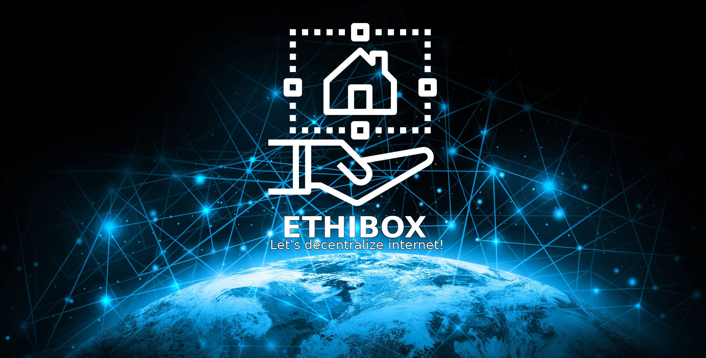

<p align="center">
  <a href=".github/CHANGELOG.md"></a>
    &nbsp;
  <a href="LICENSE.txt"></a>
    &nbsp;
  <a href="https://travis-ci.org/ston3o/ethibox/"></a>
    &nbsp;
  <a href="https://codeclimate.com/github/ston3o/ethibox"></a>
    &nbsp;
  <a href="https://liberapay.com/ston3o/donate"></a>
</p>

<div align="center">
  <h4>
    <a href="http://demo.ethibox.fr">Demo</a>
    <span> | </span>
    <a href=".github/CONTRIBUTING.md">Contributing</a>
    <span> | </span>
    <a href="https://www.reddit.com/r/ethibox/">Reddit</a>
  </h4>
</div>

<div align="center">
  <sub>Made with <span style="color:red">❤︎</span> by <a href="https://ston3o.me">ston3o</a> for the Open-Source Community
</div>

---

## Why ?

- Because internet is centralized and lacks of privacy
- Because it's not easy to self-hosted
- Because free software ❤︎

## TL;DR

```bash
helm install --namespace kube-system --name ethibox https://github.com/ston3o/ethibox/raw/master/charts/packages/ethibox-0.1.0.tgz
```

## Getting Started

These instructions will get you a copy of the project up and running on your local machine for development and testing purposes. See deployment for notes on how to deploy the project on a live system.

### Requirements

* [Minikube](https://github.com/kubernetes/minikube) - Run Kubernetes locally.
* [Telepresence](https://github.com/datawire/telepresence/) - Local development against a remote Kubernetes.
* [Node.js](https://github.com/nodejs/node) - Node.js

### Installation

```bash
minikube start
make install
make enter
make dev
```

## How it works

```
         ┌ ─ ─ ─ ─ ─ ─ ─ ─ ─ ─ ─ ─ ─ ─ ─ ─ ─ ─ ─ ─ ─ ─ ─ ─ ─ ─ ─ ─ ─ ─ ─ ─ ─ ─ ─ ─ ─ ─ ─ ─ ┐
         │                      ┌──────────┐                                               │
         │                  ┌──▶│ Mastodon │◀──┐                                           │
         │                  │   └──────────┘   │                                           │
         │                  │                  │                                           │
      80,443   ┌─────────┐  │   ┌──────────┐   │  ┌────────────────┐    ┌──────────────┐   │
User ─────────▶│ traefik │─────▶│ Ghost    │◀─────│ Kubernetes API │◀───│ Helm + swift │   │
         │     └─────────┘  │   └──────────┘   │  └────────────────┘    └──────────────┘   │
         │          │       │                  │           ▲                   ▲           │
         │          │       │   ┌──────────┐   │           │                   │           │
         │          │       └──▶│ ∞        │◀──┘           │                   │           │
         │          │           └──────────┘               │                   │           │
         │          │                                      │                   │           │
         │          │           ┌──────────┐               │      charts       │           │
         │          └──────────▶│ Ethibox  │───────────────┘───────────────────┘           │
         │                      └──────────┘                                               │
         │                                                               Bare metal server │
         └ ─ ─ ─ ─ ─ ─ ─ ─ ─ ─ ─ ─ ─ ─ ─ ─ ─ ─ ─ ─ ─ ─ ─ ─ ─ ─ ─ ─ ─ ─ ─ ─ ─ ─ ─ ─ ─ ─ ─ ─ ┘
```

## Deployment

```bash
helm install --namespace kube-system --name ethibox http://demo.ethibox.fr/charts/ethibox-0.1.0.tgz
```

## Running the tests

```bash
make start-selenium
make test
```

## Built With

* [Kubernetes](https://github.com/kubernetes/kubernetes) - Production-Grade Container Scheduling and Management.
* [helm](https://github.com/kubernetes/helm) - The Kubernetes Package Manager.
* [React](https://github.com/facebook/react) - A declarative, efficient, and flexible JavaScript library for building user interfaces.
* [Redux](https://github.com/reactjs/redux) - Predictable state container for JavaScript apps.
* [Express](https://github.com/expressjs/express) - Fast, unopinionated, minimalist web framework for node.
* [Semantic UI](https://github.com/semantic-org/semantic-ui) - UI component framework based around useful principles from natural language.

## Todo

[](https://api.gh-polls.com/poll/01C4QPC0NMHB3XQZV1K56XH1EF/DNS%20support%20-%20Add%20vhosts%20from%20client/vote)
[](https://api.gh-polls.com/poll/01C4QPC0NMHB3XQZV1K56XH1EF/Let%27s%20encrypt%20support%20-%20Enable%20or%20disable%20for%20each%20application/vote)
[](https://api.gh-polls.com/poll/01C4QPC0NMHB3XQZV1K56XH1EF/TOR%20support%20-%20Enable%20or%20disable%20for%20each%20application/vote)
[](https://api.gh-polls.com/poll/01C4QPC0NMHB3XQZV1K56XH1EF/VPN%20support%20with%20public%20static%20IP/vote)
[](https://api.gh-polls.com/poll/01C4QPC0NMHB3XQZV1K56XH1EF/Multi-node%20cluster%20support%20with%20auto%20horizontal%20scale/vote)
[](https://api.gh-polls.com/poll/01C4QPC0NMHB3XQZV1K56XH1EF/Add%20auto%20backup%20system/vote)

## Contributing

Please read [CONTRIBUTING.md](.github/CONTRIBUTING.md) for details on our code of conduct, and the process for submitting pull requests to us.

## Help support ethibox

Support me with a monthly donation and help me continue my activities:

[](https://liberapay.com/ston3o/donate)

Buy me a beer (BTC): 112aZxX9Jiya4TM6Le4foxTq9V8U6aVGbG

## License

This project is licensed under the GNU GPL v3.0 - see the [LICENSE.txt](LICENSE.txt) file for details

**Free Software, Hell Yeah!**
